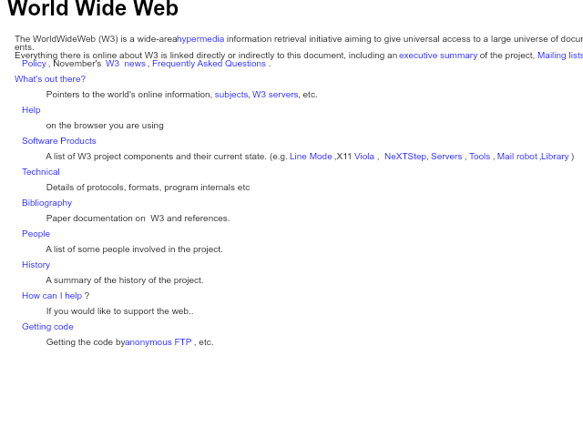

# Leveret

Leveret is an experimental web browser written in TypeScript for the Bun runtime
and it uses the Skia graphics system via `@napi-rs/canvas`.

This is how Leveret looks displaying the first-ever web page:



Leveret started off as a submission to the seminal [Browser Jam hackathon](https://github.com/BrowserJam/browserjam)
organized by [Andreas Kling](https://x.com/awesomekling) of the [Ladybird browser](https://ladybird.org/)
fame.

You can find [the submission here](https://github.com/BrowserJam/jam001/pull/14).

As of current, it has not progressed beyond the hackathon submission quality
state; perhaps during the next Browser Jam, more improvements will be delivered.

## Tasks

### Improve the HTML parser to not set a node as `cursor` until fully closed

Right now, I'm materializing nodes the moment their opening tag finishes parsing
which allows me to simplify the attribute parsing states, but results in an
unfaithful representation of the incomplete DOM tree (stuff that's not fully
commited should be shuffled via state, not the tree) and complicates recognizing
some scenarios like `` versus `` and when to materialize it which
would be unambiguous if tags were persisted to the node tree only once closed.

### Use Bun's C compilation feature to show a native window to stream RGBA onto

Bun is set to release built-in support for C code compilation.
This could allow me to use native OS APIs to call up a native window and flush a
buffer onto its surface.

[Bun Twitter post about native code compilation](https://x.com/jarredsumner/status/1834880518757781919)

Use Cocoa to display a native macOS window, make an `NSImageView` and export a
method that takes `unsigned char *rgbaBuffer` and builds a `NSBitmapImageRep`
from it, then `NSImage` from the bitmap and sets the image to the image view.

Next up, react to the window size changes by either polling on every frame on
the Bun side or figuring out how to export a method that takes Bun callbacks and
calls them in response to the macOS side event loop resize event entries.

This will allow me to dynamically resize the `canvas` and its context to react
to the window resizing events and re-layout.

Next up, listen to keyboard and mouse events to be able to add interactivity to
the renderer and bring the whole project closer to a full browser.

Then there is a question of the browser chrome and whether to implement it in
native code (I am leaning towards that right now) or as a dedicated separate
area on the render surface (need to make sure the page can't bleed into it).

### Set up a GitHub Actions workflow to publish native executables on each push

Use the Bun GitHub Action to run the `compile` command and publish the resulting
build artifacts to the Releases tab on GitHub.

### Monitor Bun's API surface for a built-in `DOMParser` implementation support

https://github.com/oven-sh/bun/discussions/1522

This would allow me to drop the bespoke HTML to DOM parsing logic.
Arguably, this takes away from the home-grown-ness of the web browser, but the
layout part would remain bespoke and I am happy to shift any part of the process
to a Bun built-in, but not a non-built-in dependency.

## Notes

### Architecture overview

The script downloads the HTML text of the URL and parses it to a simple DOM tree
which gets visited during the layout stage and adorned with layout metadata like
coordinates and dimensions of each element.

Text runs that are too long to fit the viewport get wrapped by breaking up their
patern inline element into several pieces as they fit the viewport constraints.

In the final phase, the tree is walked and each node recursively rendered onto
the Skia-based `canvas`-like rendering surface.

The rendered frame gets saved to a file named `index.png`.

The current architecture doesn't handle user interactivity (scrolling, clicking,
selecting etc.) nor does it render into a native OS window yet.

### Technology choices

TypeScript was selected because I like it as a programming language.
If I didn't choose TypeScript, I would have chosen JavaScript instead.

I really like Bun for its versatility and battery-included nature.
The programming language decision was also driven by the fact that I knew I was
going to use Bun as the runtime.

I didn't contemplate using Node or Deno, because while they are getting better,
they are not nearly as pain-free to set up and get productive with as Bun is.

One example of this is the ability to use `@napi-rs/canvas` as a zero-dependency
dependency straight-away without having to deal with Gyp or Node native modules.
It is possible that this would also work right away in Node or Deno, but it is
only one of many interactions with the toolchain that Bun makes smooth.

Bun has supported easy depending on and bundling of Node native modules since
version 1.0.23, in whose release notes I found out about `@napi-rs/canvas`:

[Bun 1.0.23 release notes](https://bun.sh/blog/bun-v1.0.23#embed-node-files-with-bun-build-compile)

I didn't consider using a native runtime or a runtime-free programming language
like C, C++, Rust, Zig or C#/.NET due to tool-chain setup unpleasantness.
To me, none of these are as problem-free to set up and get going with as Bun is,
it only takes three commands to install it, install the dependencies and run the
code or compile it to a native executable.

The closest non-JavaScript/non-TypeScript experience to this would probably be
Ruby, but I don't like the programming language and while I prefer to minimize
my use of dependencies, when I have to use some, I prefer to reach for ones in
the Node ecosystem over the ones in the Ruby ecosystem.

## Dependency choices

I am using `latest` versions of all dependencies (`@napi-rs/canvas` and Bun's
types as a development dependenct) as I want the code to break the moment a new
version comes out so I can immediately switch to it and adjust my code for it.

I would use Bun for HTML parsing if it supported `DOMParser` out-of-the-box and
will do it if it ever does.

In general, my rule is to use the built-in thing first, write it myself second
and use a dependency a distant third.

### Development workflow (testing, debugging)

I use VS Code.

There are several ways in which Leveret can be developed and I switch between
them.

Most often, I'll write code and periodically check it using tests.
Tests can be run using `bun test` or `bun test *.test.ts`.
I use `test.only`, `test.skip`, `test.todo` etc. to control what tests run atop
the test file name specified in the CLI argument.

Sometimes, I'll want to write code and observe the graphical impact of the edits
I made.
In this scenario, I'll open `index.ts` and `index.png` side-by-side in VS Code
and run `bun --watch .` to make sure all code changes get picked up and executed
resulting in `image.png` refreshing in its editor pane in VS Code.
This gives quick visual feedback that can sometimes be faster than normal tests.

When I want to use the debugger, I make use of the [Bun VS Code extension](https://bun.sh/guides/runtime/vscode-debugger)
that adds Run File and Debug File buttons to the top-right of the code editor
area.

There is no need to set up a VS Code debugger configuration to make this work.

I also use snapshot testing which is unfortunately more home-made that I'd like
due to Bun's lack of control over snapshot testing behavior.

Bun support snapshot testing out-of-the-box, but AFAIK cannot be configured to
tell the test runner what file names to use for the snapshots and where to put
them, so they cannot be easily previewed in VS Code for a quick check.

For this reason, I implement a custom helper to check the snapshots and store
them under my desired path related to the test file.

But also doesn't yet allow a test to know its name programatically, so for the
snapshot testing, I need to manually repeat the test name for the snapshot name.

## Logs

### 2024-09-15 Sunday

#### Cleared up the `@napi-rs/canvas` API confusion I asked about in a ticket

https://github.com/Brooooooklyn/canvas/issues/894

- `toBuffer` - synchronous
- `encode` - asynchronous
- `data` - same as `CanvasRenderingContext2D.getImageData` (both RGBA)

#### Submitted the hackathon submission to the Browser Jam #1 repository

https://github.com/BrowserJam/jam001/pull/14

My submission was quickly merged.

[I also shared it on Twitter](https://x.com/tomashubelbauer/status/1835343613196108097).

#### Finalized the hackathon submission (layout and render stages completed)

I've progressed on the layout engine most of the day and then topped the work
off with a method for rendering the laid out page.

I've added tests for both of these stages as well as tests for the HTML parser.

### 2024-09-14 Saturday

#### Implemented HTML parsing of the Browser Jam #1 first WWW page assignment

I've crafted a very basic HTML parser capable of understanding the assignment
web page, but not much more.

#### Started the repository and put together the basic `@napi-rs/canvas` PoC

This project was inspired by the first ever BrowserJam announced by Andreas
Kling, the founder of the Ladybird browser:

- [Twitter announcement post](https://x.com/awesomekling/status/1834625388510585276)
- [BrowserJam repository](https://github.com/BrowserJam/browserjam)

The project repository is at [`tomashubelbauer/leveret` on GitHub](https://github.com/TomasHubelbauer/leveret).

I installed the Canvas package using `bun add @napi-rs/canvas`.
It installs the main package `@napi-rs/canvas` and a platform-specific package,
in my case `@napi-rs/canvas-darwin-arm64`.

The package has no other dependencies and ships as Node native module (`.node`),
not as plain TypeScript/JavaScript.

See [`Brooooooklyn/canvas` on GitHub](https://github.com/Brooooooklyn/canvas)
for the repository and [`@napi-rs/canvas` on NPM](https://www.npmjs.com/package/@napi-rs/canvas)
for the Node package.

We can see the native module working with this simple script:

(Dependencies installed are `@napi-rs/canvas` and `@types/bun` (development).)

`index.tx`:

```typescript
import { createCanvas } from '@napi-rs/canvas';
import { write } from 'bun';

const canvas = createCanvas(640, 480);
const context = canvas.getContext('2d');

context.fillStyle = 'white';
context.fillRect(0, 0, canvas.width, canvas.height);

context.fillStyle = 'black';
context.fillText('Hello, world!!', 10, 50);

const buffer = await canvas.encode('png');
await write('index.png', buffer);
```

Run using `bun .` and open `index.png` to see the resulting image.

We can also run the example into a native binary using `bun build --compile .`.
The resulting `index` executable requires no dependencies (no `node_modules`)
and can be shipped and ran standalone.
